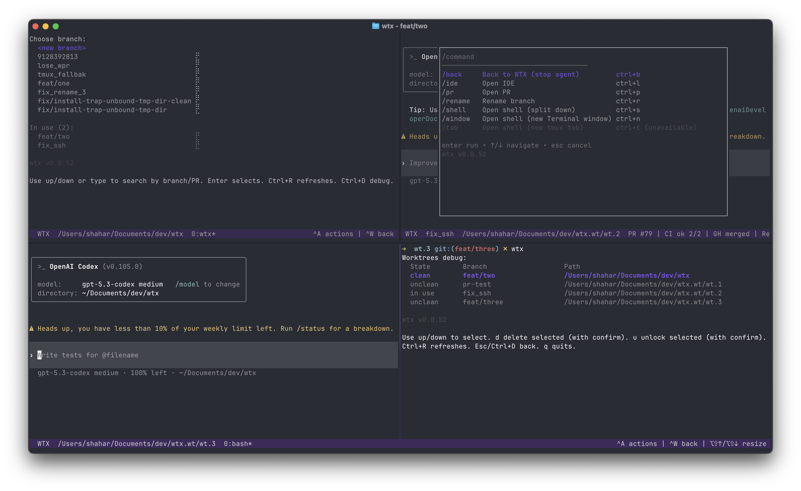

# wtx
wtx is a CLI that automates Git worktrees for AI agents. 

In large repos, creating and bootstrapping worktrees is slow and manual.

wtx manages a pool of reusable worktrees and automatically assigns one to the branch you select.

Works in any terminal (ghostty, iTerm, etc.) and with any AI agent (Claude, Codex, ...).



## Quickstart

```sh
wtx checkout -b feat/first
# open another terminal
wtx checkout -b feat/second
```

interactively:
```sh
wtx
```

## Installation

```sh
curl -fsSL https://raw.githubusercontent.com/aixolotls/wtx/main/install.sh | bash
```

Alternative (requires Go):
```sh
go install github.com/aixolotls/wtx@latest
```

## Other Features
- Open your ide easily on a worktree's subfolder, to avoid indexing tax in large repos (requires tmux)
- Get an interactive shell quickly in the worktree (requires tmux)
- Terminal tab naming: keeps branch context visible while juggling many monorepo sessions (requires tmux)
- GitHub integration: surfaces merge, review, and CI status where you are already working

## License
[MIT](LICENSE)
